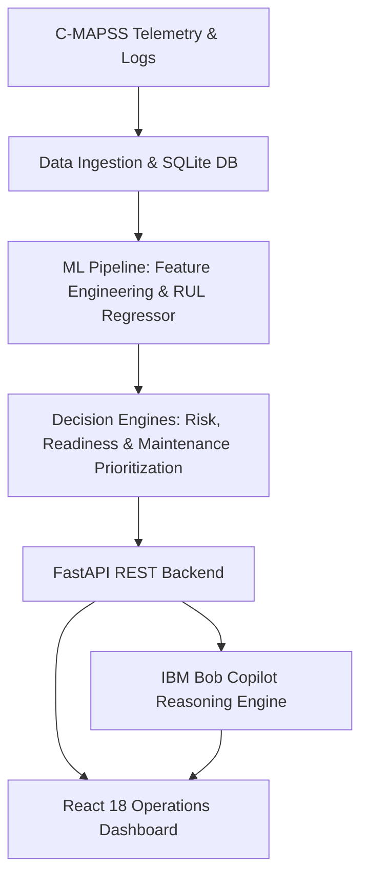

# MissionGuard AI — Mission Readiness & Predictive Maintenance Copilot

**BOB AI Hackathon 2026 — Challenge D1 (Defense & Aerospace)**  
**Team:** AeroX  
**Tagline:** *"Know what's mission-ready. Predict what's next. Act before failure."*  

---

## 1. Executive Summary & Problem Addressed

Defense aerospace organizations currently rely on rigid, calendar-based maintenance schedules regardless of actual aircraft component wear. Millions of dollars in Health & Usage Monitoring System (HUMS) sensor data sit unanalyzed while unexpected platform groundings cost billions annually and risk mission-critical operations.

**MissionGuard AI** solves this operational challenge. Powered by **IBM Bob**, MissionGuard ingests multi-channel turbofan sensor telemetry and maintenance records to:
1. Identify non-ready assets before assignment to mission windows.
2. Accurately predict Remaining Useful Life (RUL) through leakage-free machine learning.
3. Compare predicted RUL against upcoming mission requirements to calculate objective mission readiness.
4. Explain the physical telemetry evidence (e.g. compressor temperature and friction drift) behind readiness issues.
5. Prioritize actionable maintenance tasks (P1 Critical, P2 Urgent, P3 Scheduled) grounded in aviation maintenance knowledge.
6. Provide an operational conversational copilot via IBM Bob for instant commander decision support.

---

## 2. Key Implemented Features

- **Leakage-Free RUL Regression Pipeline**: Trained on NASA C-MAPSS turbofan data using strictly entity-isolated asset splits (27 train, 6 val, 5 test) and backward-looking rolling statistics (windows 5, 10, 20).
- **Mission-Window Aware Readiness Engine**: Evaluates asset RUL against future-facing mission scenarios to categorize assets into 4 clear readiness tiers: `READY`, `READY WITH MONITORING`, `NEEDS INSPECTION`, and `NOT READY`.
- **Physical Sensor Evidence Generator**: Automatically generates human-understandable evidence bullet points linking sensor drift ($s_2, s_9, s_{11}$) to mission buffer shortfalls.
- **Maintenance Prioritization Queue**: Ranks maintenance actions by urgency and pairs degradation patterns with relevant repair procedures from aviation maintenance logs.
- **Load-Bearing IBM Bob Copilot**: Connects via 9 structured MCP/REST tools to answer complex operational questions conversationally with live evidence and zero hallucinations.
- **Full-Stack Aerospace Dashboard**: High-density React 18 + TypeScript + Vite + Tailwind CSS console featuring 6 complete views and interactive Recharts telemetry visualizations.

---

## 3. High-Level Architecture



---

## 4. Tech Stack

- **Backend & ML**: Python 3.10–3.13, FastAPI, Pydantic, SQLAlchemy, SQLite, scikit-learn, joblib, Pandas, NumPy
- **Frontend**: React 18, TypeScript, Vite, Tailwind CSS, Recharts, Lucide Icons
- **AI & Copilot**: IBM Bob Decision Tools, MCP Standard, Granite-3.0 LLM integration
- **DevOps & Testing**: Pytest, GitHub Actions Automated Validator, ReportLab

---

## 5. Quickstart & Local Setup

### Prerequisites
- Python 3.10+
- Node.js 18+ and npm 9+
- Git

### Installation & Run Steps
```bash
# 1. Clone repository
git clone https://github.com/ShivamJoshi7906/bob-ai-hackathon-AeroX.git
cd bob-ai-hackathon-AeroX

# 2. Setup environment
cp src/.env.example src/.env

# 3. Install Python dependencies
pip install fastapi uvicorn pydantic sqlalchemy pandas numpy scikit-learn joblib pytest

# 4. Seed database and train ML model
python data/load_data.py
python src/ml/train.py

# 5. Start FastAPI Backend (Terminal 1)
uvicorn src.backend.app.main:app --reload --port 8000

# 6. Start Frontend Dashboard (Terminal 2)
cd src/frontend
npm install
npm run dev
```

Open your browser at `http://localhost:5173` to explore the dashboard.

---

## 6. The IBM Bob Copilot Experience

Ask Bob the 3 mandatory hackathon questions directly from the copilot interface:
1. *"Which assets are not ready?"* → Bob retrieves non-ready assets, negative mission buffers, and risk levels.
2. *"Why is AC-003 not ready?"* → Bob explains the RUL shortfall, temperature drift, and core speed drop.
3. *"What should maintenance do first?"* → Bob presents the ranked P1–P3 queue with recommended repair procedures.

---

## 7. Submission Artifacts & Links

- **Setup Guide:** [`docs/setup-guide.md`](docs/setup-guide.md)
- **Technical Architecture:** [`docs/architecture.md`](docs/architecture.md)
- **ML Methodology:** [`docs/ml-methodology.md`](docs/ml-methodology.md)
- **IBM Bob Integration:** [`docs/bob-integration.md`](docs/bob-integration.md)
- **Data Provenance & Safety:** [`docs/data-provenance.md`](docs/data-provenance.md)
- **Hackathon Score Audit:** [`docs/hackathon-score-audit.md`](docs/hackathon-score-audit.md)
- **Presentation Slide Deck:** [`presentation/MissionGuard-AI.pptx`](presentation/MissionGuard-AI.pptx)
- **Demo Video:** [`demo/demo-video-link.txt`](demo/demo-video-link.txt)
- **Demo Screenshots:** [`demo/screenshots/`](demo/screenshots/)

---

## 8. What We Are Most Proud Of

The end-to-end operational decision chain: MissionGuard does not stop at warning that an engine is degrading; it evaluates whether that engine can survive its specific upcoming mission, explains the underlying physical sensor drift, and provides commanders with an actionable, prioritized maintenance plan via IBM Bob.
