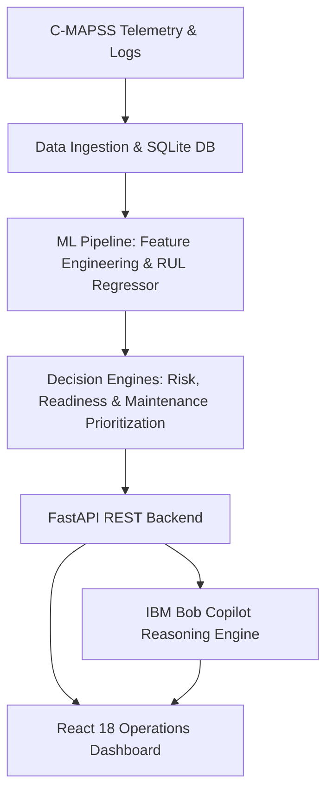

# 🚀 MissionGuard AI — Mission Readiness & Predictive Maintenance Copilot

**BOB AI Hackathon 2026 — Challenge D1 (Defense & Aerospace)**

> *"Know what's mission-ready. Predict what's next. Act before failure."*

---

## 👥 Team

- **Team Name:** AeroX
- **Track:** AI
- **Team Lead:** Dhruvi Kundariya ([dhruvikundariya5@gmial.com](mailto:dhruvikundariya5@gmial.com))
- **Team Members:**
  - Marshal Godhani ([marshalgodhani@gmail.com](mailto:marshalgodhani@gmail.com))
  - Shivam Joshi ([shivamjoshi7906@gmail.com](mailto:shivamjoshi7906@gmail.com))
  - Shreya Adroja ([adrojashreya0@gmail.com](mailto:adrojashreya0@gmail.com))

**AeroX** is a 4-member team focused on applying AI, machine learning, and full-stack engineering to real-world aerospace maintenance and mission-readiness challenges.

| Team Member | Role | Contribution |
|---|---|---|
| **Shivam Joshi** | AI/ML | RUL prediction, feature engineering, model validation, and overall system architecture |
| **Shreya Adroja** | Backend & Data Engineering | Data pipeline, database, FastAPI services, and prediction/readiness APIs |
| **Dhruvi Kundariya** | Frontend & Visualization | React dashboard, telemetry visualization, asset monitoring, and user experience |
| **Marshal Godhani** | IBM Bob & Integration | IBM Bob copilot integration, tool workflows, documentation, and demo integration |

---

## 🎯 Problem Statement

Defense aerospace organizations currently rely on rigid, calendar-based maintenance schedules regardless of actual aircraft component wear. Millions of dollars in Health & Usage Monitoring System (HUMS) sensor data sit unanalyzed while unexpected platform groundings cost billions annually and risk mission-critical operations.

The people who feel this pain are maintenance commanders and operations planners, who must decide whether an aircraft can be assigned to an upcoming mission without any objective, condition-based evidence of what will fail and when.

---

## 💡 Solution

**MissionGuard AI** is an operational decision-support copilot powered by **IBM Bob**. It ingests multi-channel turbofan sensor telemetry and maintenance records, predicts Remaining Useful Life (RUL) through a leakage-free ML pipeline, and compares that prediction against upcoming mission-window requirements to calculate objective mission readiness.

Rather than only predicting component degradation, the system connects RUL, sensor evidence, mission requirements, readiness, and maintenance priorities into a single workflow:

1. Identify non-ready assets before assignment to mission windows.
2. Accurately predict Remaining Useful Life (RUL) through leakage-free machine learning.
3. Compare predicted RUL against upcoming mission requirements to calculate objective mission readiness.
4. Explain the physical telemetry evidence (e.g. compressor temperature and friction drift) behind readiness issues.
5. Prioritize actionable maintenance tasks (P1 Critical, P2 Urgent, P3 Scheduled) grounded in aviation maintenance knowledge.
6. Provide an operational conversational copilot via IBM Bob for instant commander decision support.

---

## ✨ Key Features

- **Leakage-Free RUL Regression Pipeline:** Trained on NASA C-MAPSS turbofan data using strictly entity-isolated asset splits (27 train, 6 val, 5 test) and backward-looking rolling statistics (windows 5, 10, 20).
- **Mission-Window Aware Readiness Engine:** Evaluates asset RUL against future-facing mission scenarios to categorize assets into 4 clear readiness tiers: `READY`, `READY WITH MONITORING`, `NEEDS INSPECTION`, and `NOT READY`.
- **Physical Sensor Evidence Generator:** Automatically generates human-understandable evidence bullet points linking sensor drift (s₂, s₉, s₁₁) to mission buffer shortfalls.
- **Maintenance Prioritization Queue:** Ranks maintenance actions by urgency and pairs degradation patterns with relevant repair procedures from aviation maintenance logs.
- **Load-Bearing IBM Bob Copilot:** Connects via 9 structured MCP/REST tools to answer complex operational questions conversationally with live evidence and zero hallucinations.
- **Full-Stack Aerospace Dashboard:** High-density React 18 + TypeScript + Vite + Tailwind CSS console featuring 6 complete views and interactive Recharts telemetry visualizations.

---

## 🛠️ Tech Stack

| Category | Technologies |
|---|---|
| **Languages** | Python 3.10–3.13, TypeScript, SQL |
| **Frameworks** | FastAPI, Pydantic, React 18, Vite, Tailwind CSS, scikit-learn |
| **IBM Technologies** | IBM Bob, IBM Bob Decision Tools (MCP), Granite-3.0 LLM integration |
| **Databases** | SQLite, SQLAlchemy |
| **Other** | Pandas, NumPy, joblib, Recharts, Lucide Icons, Pytest, GitHub Actions, ReportLab |

---

## 🏗️ High-Level Architecture



---

## 📁 Repository Structure

```
├── src/                  # All source code (backend, ML, frontend)
├── data/                 # Dataset and data loading scripts
├── scripts/              # Utility and build scripts
├── tests/                # Pytest test suite
├── docs/                 # Written documentation
│   ├── setup-guide.md
│   ├── architecture.md
│   ├── ml-methodology.md
│   ├── bob-integration.md
│   ├── data-provenance.md
│   └── hackathon-score-audit.md
├── demo/                 # Demo artifacts
│   ├── screenshots/      # App screenshots
│   └── demo-video-link.txt  # Link to demo video
├── presentation/         # Slide deck
└── submission.yaml       # Structured submission metadata
```

---

## ⚡ How to Run

> **Copy these exact steps from [`docs/setup-guide.md`](docs/setup-guide.md)**

### Prerequisites
- Python 3.10+
- Node.js 18+ and npm 9+
- Git

```bash
# 1. Clone repository
git clone https://github.com/ShivamJoshi7906/bob-ai-hackathon-AeroX.git
cd bob-ai-hackathon-AeroX

# 2. Setup environment
cp src/.env.example src/.env

# 3. Install Python dependencies
pip install fastapi uvicorn pydantic sqlalchemy pandas numpy scikit-learn joblib pytest

# 4. Seed database and train ML model
python data/load_data.py
python src/ml/train.py

# 5. Start FastAPI Backend (Terminal 1)
uvicorn src.backend.app.main:app --reload --port 8000

# 6. Start Frontend Dashboard (Terminal 2)
cd src/frontend
npm install
npm run dev
```

Open your browser at `http://localhost:5173` to explore the dashboard.

---

## 🤖 The IBM Bob Copilot Experience

Ask Bob the 3 mandatory hackathon questions directly from the copilot interface:

1. *"Which assets are not ready?"* → Bob retrieves non-ready assets, negative mission buffers, and risk levels.
2. *"Why is AC-003 not ready?"* → Bob explains the RUL shortfall, temperature drift, and core speed drop.
3. *"What should maintenance do first?"* → Bob presents the ranked P1–P3 queue with recommended repair procedures.

---

## 🖥️ Demo

| Artifact | Link |
|---|---|
| 📹 Demo Video | [Watch Demo Video (Google Drive)](https://drive.google.com/file/d/1XtydPZPkD7NgdoFOGAOKtN2WaGAi2Nz2/view?usp=sharing) · [`demo/demo-video-link.txt`](demo/demo-video-link.txt) |
| 🌐 Live Demo | Not deployed — local demo provided ([`demo/live-demo-url.txt`](demo/live-demo-url.txt)) |
| 🖼️ Screenshots | [`demo/screenshots/`](demo/screenshots/) |
| 📊 Presentation | [`presentation/MissionGuard-AI.pptx`](presentation/MissionGuard-AI.pptx) |

### Additional Documentation

| Document | Link |
|---|---|
| Setup Guide | [`docs/setup-guide.md`](docs/setup-guide.md) |
| Technical Architecture | [`docs/architecture.md`](docs/architecture.md) |
| ML Methodology | [`docs/ml-methodology.md`](docs/ml-methodology.md) |
| IBM Bob Integration | [`docs/bob-integration.md`](docs/bob-integration.md) |
| Data Provenance & Safety | [`docs/data-provenance.md`](docs/data-provenance.md) |
| Hackathon Score Audit | [`docs/hackathon-score-audit.md`](docs/hackathon-score-audit.md) |

---

## ⚠️ Known Limitations

- **Dataset Scope:** The predictive-maintenance model is demonstrated using NASA C-MAPSS FD001 turbofan telemetry, which represents a simulated turbofan degradation scenario rather than real military aircraft telemetry.
- **Degradation Coverage:** The current model is not validated across all possible aircraft or engine failure modes and should not be interpreted as a universal aircraft-health model.
- **Synthetic Operational Context:** Mission windows and certain maintenance/health relationships are synthetic or derived for the demonstration and are clearly documented in the data-provenance documentation.
- **Readiness Assessment:** The readiness tiers and thresholds are project-defined decision-support rules, not aviation certification or flight-safety standards.
- **Real-World Deployment:** Operational deployment would require validation with real fleet data, aircraft-specific calibration, engineering oversight, and appropriate safety/certification processes.
- **Decision Support:** MissionGuard and IBM Bob provide evidence-based decision support; final maintenance and mission decisions remain with qualified human personnel.

---

## 🏅 What We're Most Proud Of

The end-to-end operational decision chain: MissionGuard does not stop at warning that an engine is degrading; it evaluates whether that engine can survive its specific upcoming mission, explains the underlying physical sensor drift, and provides commanders with an actionable, prioritized maintenance plan via IBM Bob.

---
