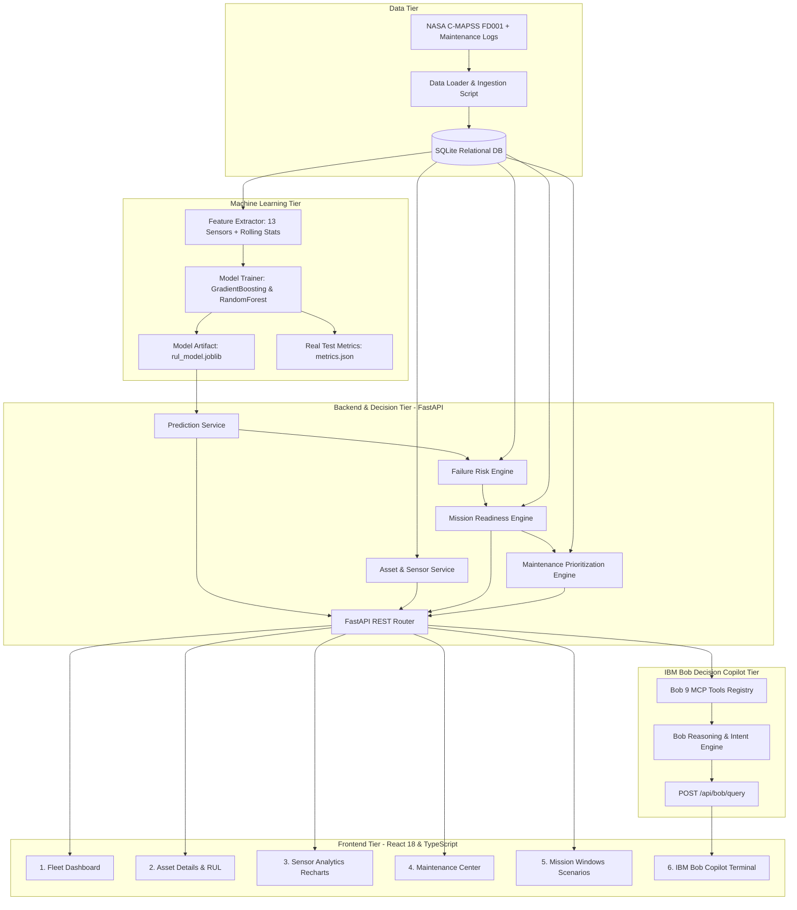

# Technical Architecture: MissionGuard AI

**Team:** AeroX  
**Challenge:** D1 — Mission Readiness & Predictive Maintenance Copilot  

---

## 1. System Architecture Diagram

---

## 2. Component Inventory & Responsibilities

| Component | Tech Stack | Primary Responsibility |
|---|---|---|
| **Data Layer** | SQLite, SQLAlchemy ORM | Manages tables for assets, sensor readings (8,169 cycles), maintenance records, failure events, mission windows, and component health. |
| **ML Pipeline** | Python, scikit-learn, joblib | Anti-leakage rolling feature extraction, RUL regression modeling, 30-cycle early warning classification, offline evaluation on 5 unseen test engines. |
| **Backend REST API** | FastAPI, Pydantic, Uvicorn | Exposes typed REST endpoints for fleet summaries, asset telemetry, RUL predictions, readiness evaluations, and maintenance rankings. |
| **Decision Engines** | Python services | Evaluates risk tiers (`LOW` to `CRITICAL`), computes mission compatibility (0–100 score + 4 categories), and prioritizes maintenance (P1–P3). |
| **IBM Bob Copilot** | Python, MCP Tools, REST | Structured reasoning agent equipped with 9 domain tools to explain non-ready assets, sensor evidence, and immediate maintenance actions. |
| **Frontend Dashboard** | React 18, TypeScript, Vite, Tailwind CSS, Recharts | High-density aerospace command console providing 6 operational views, responsive degradation charts, and an interactive Bob copilot chat. |

---

## 3. Data Flow End-to-End

1. **Telemetry Ingestion**: HUMS sensor readings ($s_2$ through $s_{21}$) are recorded per operating cycle.
2. **Feature Computation**: Rolling backward statistics (mean, std, delta over 5, 10, 20 cycles) are computed without future cycle visibility.
3. **Model Inference**: The trained `rul_model.joblib` predicts remaining useful life cycles.
4. **Mission Evaluation**: The system fetches the next scheduled mission window and compares required operating cycles against the predicted RUL.
5. **Readiness & Evidence**: If $\text{RUL} < \text{Mission Requirement} + \text{Safety Buffer}$, the asset is classified as `NOT READY` or `NEEDS INSPECTION`, and explicit physical telemetry drift reasons are generated.
6. **Maintenance Prioritization**: The asset is placed into the P1 Critical queue with recommended maintenance procedures from the knowledge base.
7. **Bob Copilot Action**: Commanders query Bob in natural language, and Bob invokes domain tools to present the readiness status and next steps.
